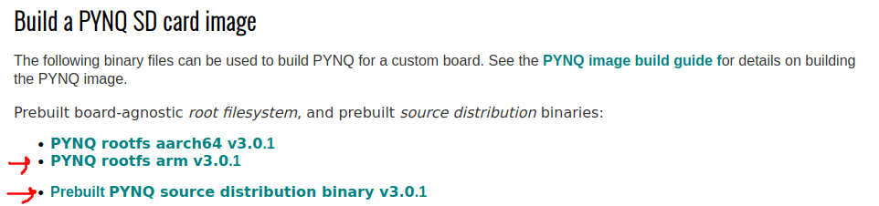
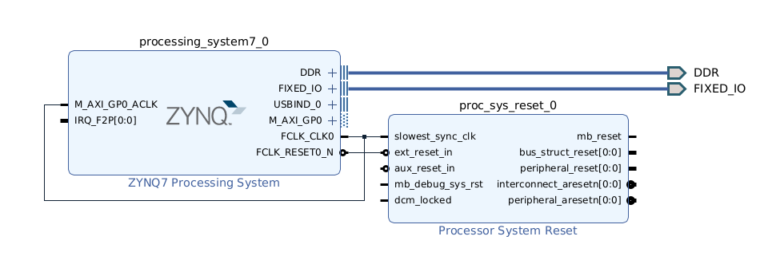

# PYNQ 3.0.1 for Zybo-Z7-20

This repo can be used as a guide to build your own PYNQ image for Digilent's [Zybo Z7-20](https://digilent.com/reference/programmable-logic/zybo-z7/start) (ZZ720) board. It was only tested for PYNQ **v3.0.1**.

It is recommended to _exactly_ follow the instructions.

## Setup

Preliminary note: this setup assumes that I want my Xilinx tools installation to be shared between my Host and VM. Let's say my Host username is _johndoe_.

### VM

This workflow **will almost certainly break if you don't use Ubuntu 20.04 VM**. Make sure to replace johndoe by YOUR username !

- Download and install [VirtualBox](https://www.virtualbox.org/)
- Create a [Ubuntu 20.04](https://ubuntu.com/download/alternative-downloads) VM. Reserve at least 150 GB of disk space for the VM. Set your VM username to your Host machine username, in this example _johndoe_.
- Change the default shell from `dash` to `bash`: `sudo dpkg-reconfigure dash`
- Setup passwordless sudo for _johndoe_ : see [this article](https://timonweb.com/devops/how-to-enable-passwordless-sudo-for-a-specific-user-in-linux/). TLDR use visudo and add `johndoe ALL=(ALL) NOPASSWD: ALL` at the end
- (Optional but recommended) Install the [VirtualBox Guest Additions](https://www.makeuseof.com/install-virtualbox-guest-additions-on-linux/) to be able to share peripherals
- Add yourself to some groups : `sudo usermod -aG dialout,vboxsf,plugdev johndoe`

### Xilinx tools

As a reminder, this README assumes that we want to _share_ the Xilinx tools' installation between Host and VM (only works on Linux). If you do not want to share it, you can install the tools anywhere inside your VM. 

After configuring your VM, **on your host machine**, install Xilinx tools **2022.1**. I recommend installing all of them to `${HOME}/Xilinx/`:

- Vivado
- Vitis
- PetaLinux

After the installation is complete, create a shared folder between your Host and VM:

- Folder Path: `/home/johndoe/Xilinx`
- Folder Name: Xilinx
- Mount point: `/home/johndoe/Xilinx`
- [x] Auto-mount 
- [x] Make Permanent 

Now, your VM should have a `Xilinx` directory. From now on, we will do _everything_ inside the VM.

Then, try to run `<path_to_xilinx_tools>/Vivado/2022.1/bin/vivado`. There may be some errors, such as locale, in which case install the `en-US.UTF-8` locale. Also, some other packages may be missing. Install them too.

Add Xilinx tools to your VM's PATH via its `~/.bashrc`, and auto-source the PetaLinux/Vitis settings files:

```bash
export PATH="${PATH}:${HOME}/Xilinx/Vivado/2022.1/bin/"
export PATH="${PATH}:${HOME}/Xilinx/Vitis/2022.1/bin/"
source $HOME/Xilinx/PetaLinux/settings.sh
source $HOME/Xilinx/Vitis/2022.1/settings64.sh
```

Then `source ~/.bashrc` to apply the new configuration to your current shell.

You may have to install the following dependencies:

`sudo apt-get install net-tools xterm autoconf libtool texinfo zlib1g-dev gcc-multilib zlib1g:i386 libncurses5-dev libncursesw5-dev`

### PYNQ

Finally, we are ready to build the custom SD card image. 

Start by cloning the PYNQ repository in a convenient location, in my case : `cd ~/Documents; git clone --depth 1 git@github.com:Xilinx/PYNQ.git`

Start by setting up the sdbuild flow: `./sdbuild/scripts/setup_host.sh`. Then, follow step 3 of [_Building the Image from Source_](https://pynq.readthedocs.io/en/latest/pynq_sd_card.html). _Note_: Download the 2 pre-built images circled below. As of 2024-01-14, there is a naming bug in `PYNQ rootfs arm v3.0.1`: rename its extension from `.gz` to `.tar.gz`.



Copy/move this repo's `Zybo-Z7-20` folder to `<PYNQ>/boards/`. 

Now, you can play around in the `boards/Zybo-Z7-20` files if you want to modify anything (eg change the _base_ overlay or patch the BSP).

When you're ready, from `PYNQ/sdbuild/`, build the image : `make BOARDS=Zybo-Z7-20`. If an error occurs, you can clean the build artifacts : `make clean`. Good luck !

When the build is finished, plug in an SD card (min. 16 GB recommended) and follow the [_Writing an SD Card Image_ instructions](https://pynq.readthedocs.io/en/latest/appendix/sdcard.html).

## Zynq-side

When the SD card is flashed, _eject it safely_ and insert it into ZZ720's SD card slot. Make sure JP5 is set to SD.

You can connect a USB cable to the Zybo-Z7-20 to access its serial port. On the host-side, 2 `/dev/ttyUSB*` devices should have been created by ZZ720. Access the second one and press the PS-SRST button. You should see logs and eventually land in a console.

From now, you can configure the _IP address_, install packages, etc with your ZZ720. I also recommend setting up SSH and doing remote development with VS Code !

Albeit unrelated to the build process, if you need high-performance access to PYNQ (aka not using Python), I used with great success the [PYNQ API](https://github.com/mesham/pynq_api), which allows you to interact with the PL from C. Together with Python's CFFI, it makes for a great combo.

## Notes

### Custom image build

Keep in mind that PYNQ requires exact versions of Xilinx tools. Refer to PYNQ's main page to know which versions are compatible with a given PYNQ version.

Now, some thoughts on the custom board creation process. In general, try to start from a similar board - eg ZZ720 uses a similar board to PYNQ-Z1. 

Then, create a simple `petalinux_bsp`. I had success by creating an extremely simple PS-only block design, in which I configured the proper Ethernet, USB, UART, DDR MIO pins, etc. 



Then, I exported the bitstream and exported the _hardware platform_: `File->Export->Export Hardware` to `<Zybo-Z7-20>/petalinux_bsp/hardware_project/zybo-z7-20.xsa`.

### What is _base_ ?

As for the _base overlay_ this one is loaded at boot, so feel free to include more stuff, for example HDMI, LEDs, Switches, etc. You can regenerate the _base_ BD by running `Zybo-Z7-20/base/base/base.tcl` in Vivado.

### Installing overlays

For some reason, it seems this buildflow does not install _base_ by default. As for any other overlay, just put the _base.bit_, _base.hwh_, _base.py_ in `~/pynq/overlays` and update the corresponding `__init__.py`.
